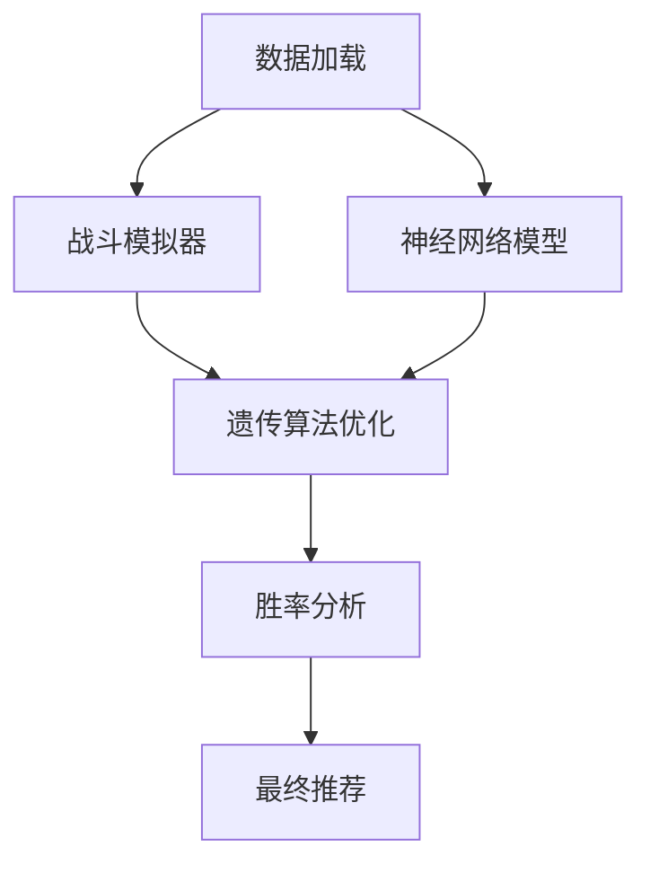
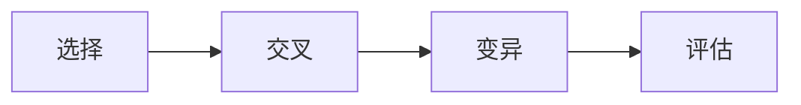

# 宝可梦团队优化算法技术报告

## 1. 算法整体架构


## 2. 核心数学模型

### 2.1 战斗伤害计算
公式：
\[
Damage = \frac{0.5 \times Attack^{1.3} \times STAB \times TypeMult}{(Defense^{0.8} + \epsilon)} \times Random(0.85,1.0)
\]

变量说明：
- $Attack$: 攻击力标准化值
- $STAB$: 同属性加成(1.5)
- $TypeMult$: 属性相克系数
- $\epsilon$: 极小值(1e-5)防止除零

代码实现：
```python
# BattleSimulator.evaluate_matchup()
base_damage = 0.5 * (safe_attack ** 1.3)
defense_factor = (defense_value ** 0.8) + 1e-5
raw_damage = base_damage * stab * type_mult / defense_factor
normalized_damage = 1 / (1 + np.exp(-raw_damage / 50 + 3))
```

### 2.2 图神经网络模型
网络结构：
\[
\begin{aligned}
h_i^{(1)} &= GAT(X_i, E) \\
h_i^{(2)} &= GAT(h_i^{(1)}, E) \\
y &= \sigma(W\cdot MeanPool(h^{(2)}))
\end{aligned}
\]

代码实现：
```python
class TeamEvaluator(nn.Module):
    def __init__(self, input_dim):
        super().__init__()
        self.gat1 = GATConv(input_dim, 64, heads=4)
        self.gat2 = GATConv(64*4, 32)
        self.fc = nn.Sequential(
            nn.Linear(32, 16),
            nn.LeakyReLU(),
            nn.Linear(16, 1),
            nn.Sigmoid()
        )

    def forward(self, data):
        x = F.leaky_relu(self.gat1(data.x, data.edge_index))
        x = F.leaky_relu(self.gat2(x, data.edge_index))
        x = global_mean_pool(x, data.batch)
        return self.fc(x).squeeze()
```

## 3. 遗传算法实现

### 3.1 适应度函数
\[
Fitness = 0.4 \times \sum TypeAdvantage + 0.3 \times (StatMean - 0.5 \times StatStd) + 0.3 \times ModelScore
\]

代码实现：
```python
def _fitness(self, team):
    # 类型优势得分
    type_score = sum(
        self.tc.get_effectiveness(type_idx, [enemy_type])
        for type_idx in team_types
    )
    
    # 属性统计得分
    stats = self.df.loc[team][Config.STATS].values
    stat_score = np.mean(stats) - 0.5 * np.std(stats)
    
    # 神经网络预测得分
    model_score = self.model.predict(team)
    
    return 0.4*type_score + 0.3*stat_score + 0.3*model_score
```

### 3.2 遗传操作


交叉操作代码：
```python
def _crossover(self, parent1, parent2):
    common = set(parent1) & set(parent2)
    unique = list(set(parent1+parent2) - common)
    child = list(common) + random.sample(unique, 6-len(common))
    return child[:6]
```

## 4. 胜率计算

蒙特卡洛模拟公式：
\[
WinRate = \frac{1}{N}\sum_{i=1}^N I(TeamScore_i > EnemyScore_i)
\]

实现代码：
```python
def calculate_win_rate(self, team, enemy_team, N=100):
    wins = 0
    for _ in range(N):
        team_score = sum(
            self.simulator.evaluate_matchup(a, d)
            for a in team for d in enemy_team
        )
        enemy_score = sum(
            self.simulator.evaluate_matchup(a, d)
            for a in enemy_team for d in team
        )
        wins += 1 if team_score > enemy_score else 0
    return wins / N
```

## 5. 性能优化技巧

1. **批量计算**：使用矩阵运算加速类型相克计算
```python
type_matrix = df[type_cols].values  # 预计算类型矩阵
```

2. **缓存机制**：存储常见对战结果
```python
@lru_cache(maxsize=10000)
def cached_matchup(a, d):
    return evaluate_matchup(a, d)
```

3. **并行计算**：使用多进程加速遗传算法
```python
with Pool(processes=4) as pool:
    scores = pool.map(self._fitness, population)
```

完整实现请参考：Test3.py
