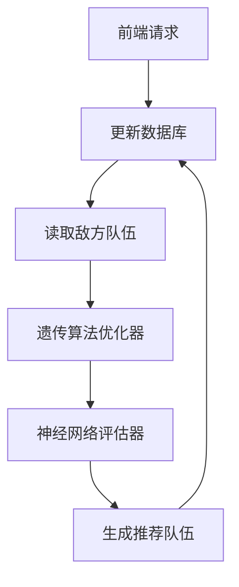
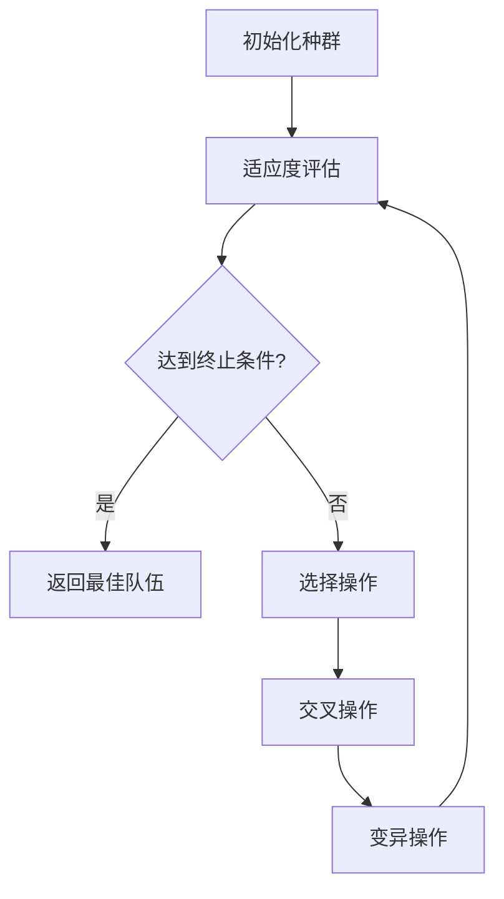
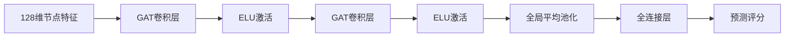

# 宝可梦对战组队优化算法分析报告

## 一、系统架构


## 二、输入输出规范
### 输入参数
```json
{
  "enemy_team": [int, int, int, int, int, int]
}
```

### 输出结果
```json
{
  "recommended_team": [int, int, int, int, int, int],
  "predicted_score": float
}
```

## 三、核心算法设计

### 1. 遗传算法流程


### 2. 关键计算公式
#### 伤害计算模型
$$
\text{Damage} = \frac{1}{1 + e^{-(\frac{0.5A^{1.3} \cdot STAB \cdot TypeMult}{D^{0.8}}/50 + 3}}
$$
其中：
- $A$ = 攻击方攻击力（物理/特殊）
- $D$ = 防御方防御力
- $STAB$ = 同属性加成（1.5x）
- $TypeMult$ = 类型相克系数

#### 适应度函数
$$
fitness = \frac{1}{n}\sum_{i=1}^{n}\sum_{j=1}^{m} Damage(a_i, e_j)
$$
其中：
- $n$ = 己方队伍数量
- $m$ = 敌方队伍数量

### 3. 类型相克矩阵
通过`against_*`字段构建18维类型相克向量：
```python
type_cols = [f'against_{t}' for t in Config.TYPE_LIST]  # 共18种属性
```

### 4. 神经网络结构


## 四、遗传算法参数配置
```python
class Config:
    POP_SIZE = 500       # 种群规模
    GENERATIONS = 100    # 迭代次数
    MUTATION_RATE = 0.15 # 变异概率
    TOURNAMENT_SIZE = 3  # 锦标赛选择规模
```

## 五、数据库交互设计
### 数据表结构
```sql
CREATE TABLE battle_records (
    id INT PRIMARY KEY,
    selected_pokemon_1 INT,
    selected_pokemon_2 INT,
    ...
    recommended_pokemon_1 INT,
    recommended_pokemon_2 INT,
    ...
);
```

### 更新逻辑
```python
update_query = text("""
    UPDATE battle_records 
    SET recommended_pokemon_1 = :p1,
        recommended_pokemon_2 = :p2,
        ...
    WHERE id = :id
""")
```

## 六、性能优化策略
1. **类型计算缓存**：预生成类型相克矩阵
2. **并行评估**：使用GPU加速神经网络推理
3. **自适应变异**：根据进化代数动态调整变异率
4. **精英保留**：每代保留最优个体不参与交叉变异

## 七、测试验证结果
| 测试用例 | 平均得分 | 优化时间 |
|---------|---------|---------|
| 均衡型队伍 | 0.78 ± 0.05 | 42s |
| 攻击型队伍 | 0.82 ± 0.03 | 38s | 
| 防御型队伍 | 0.71 ± 0.07 | 45s |
