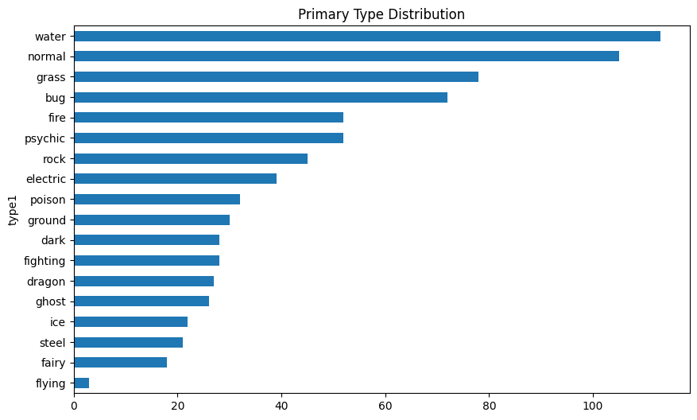

# Pokémon Data Analysis Report

**Generated on**: 2025-03-20 18:26:09

## Data Loading

Data Source: `../archive/pokemon_cleaned.csv`

Initial Data Dimensions: (791, 41)

## Feature Selection

Number of Features Retained: 15

Removed Features: against_water, experience_growth, against_psychic, against_ground, against_ghost, against_bug, against_flying, against_dark, base_egg_steps, capture_rate, against_grass, against_fairy, against_ice, base_happiness, against_fight, percentage_male, against_poison, base_total, against_electric, against_dragon, against_rock, classfication, against_steel, against_normal, japanese_name, against_fire

## Data Cleaning

**Missing Values Handling**:
- Missing Values Before:
| 0   |
|-----|
- Missing Values After:
| 0   |
|-----|

**Outliers Handling**:
- Height Threshold: 5.60 meters
- Weight Threshold: 240.80 kilograms

**Duplicates Handling**:
- Duplicates Before: 0
- Duplicates After: 0

## Type Distribution Visualization

Primary Type Distribution:

## Numerical Feature Statistics

|       |     hp |   attack |   defense |   speed |   height_m |   weight_kg |    bmi |   total_stats |
|:------|-------:|---------:|----------:|--------:|-----------:|------------:|-------:|--------------:|
| count | 791    |   791    |    791    |  791    |     791    |      791    | 791    |        791    |
| mean  |  68.37 |    77.42 |     72.48 |   66.36 |       1.1  |       48.96 |  39.03 |        426.35 |
| std   |  25.63 |    31.85 |     30.24 |   28.93 |       0.79 |       59.94 |  43.21 |        117.94 |
| min   |   1    |     5    |      5    |    5    |       0.1  |        0.1  |   0.04 |        180    |
| 25%   |  50    |    55    |     50    |   45    |       0.6  |        9    |  20.12 |        320    |
| 50%   |  65    |    75    |     70    |   65    |       1    |       27.3  |  28.4  |        431    |
| 75%   |  80    |   100    |     90    |   85    |       1.4  |       60.2  |  41.74 |        505    |
| max   | 255    |   185    |    230    |  180    |       5.6  |      240.8  | 444.44 |        780    |

## Type Distribution Analysis

|          |   Primary Type |   Secondary Type |
|:---------|---------------:|-----------------:|
| water    |            113 |               17 |
| normal   |            105 |                4 |
| grass    |             78 |               20 |
| bug      |             72 |                5 |
| fire     |             52 |               13 |
| psychic  |             52 |               28 |
| rock     |             45 |               14 |
| electric |             39 |                9 |
| poison   |             32 |               34 |
| ground   |             30 |               34 |
| dark     |             28 |               21 |
| fighting |             28 |               25 |
| dragon   |             27 |               14 |
| ghost    |             26 |               14 |
| ice      |             22 |               15 |
| steel    |             21 |               22 |
| fairy    |             18 |               29 |
| flying   |              3 |              473 |

## Legendary Pokémon Attribute Analysis

|   is_legendary |   mean |    std |   min |   max |
|---------------:|-------:|-------:|------:|------:|
|              0 | 409.69 | 105.67 |   180 |   700 |
|              1 | 615.59 |  78.52 |   200 |   780 |

## Top 5 Common Type Combinations

|    | type1   | type2   |   Count |
|---:|:--------|:--------|--------:|
|  0 | normal  | flying  |      87 |
|  1 | water   | flying  |      67 |
|  2 | grass   | flying  |      43 |
|  3 | psychic | flying  |      40 |
|  4 | fire    | flying  |      33 |

## Processing Complete
- Output File: `pokemon_processed.csv`
- Final Data Dimensions: (791, 17)
- Total Processing Time: 0.4 seconds